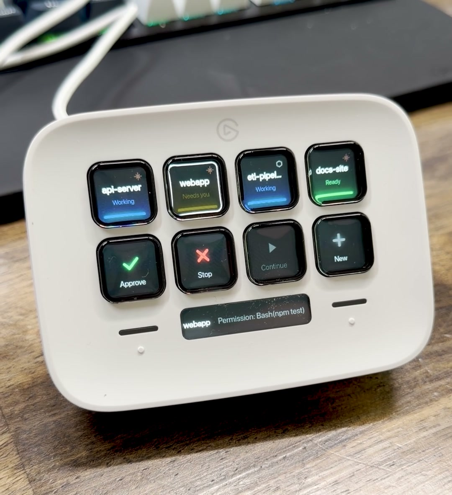
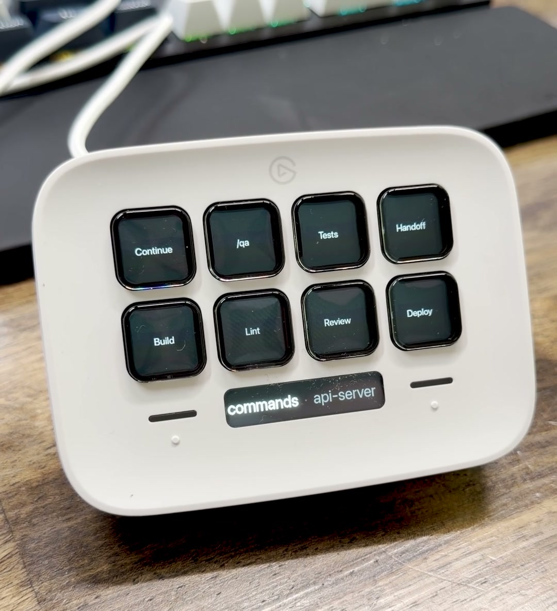

# deck_neo

[](https://github.com/mgc26/deck_neo/actions/workflows/ci.yml)

Turn an Elgato Stream Deck Neo into a physical cockpit for Claude Code sessions: see which agents are working, catch permission requests, and answer without hunting through terminal tabs.

<p align="center">
  
  
</p>

> The images show the synthetic demo loop included in this repository, not live agent sessions.

Inspired by the [Work Louder Codex Micro](https://worklouder.cc/codex-micro), `deck_neo` uses hardware you may already have to provide the monitoring-and-answering part of a dedicated agent controller.

## What it does

- **Monitors sessions at a glance.** Four top-row tiles show the current page of sessions: blue is working, amber blinking needs attention, green is ready, and an ended session goes dark.
- **Acts on the selected session.** Physical APPROVE, STOP, CONTINUE, and NEW keys send input to the correct tmux target.
- **Keeps context visible.** The Neo infobar shows the selected session and its latest event.
- **Stores repeated commands.** Either touch zone opens a bank of up to eight reusable prompts and commands.
- **Separates signal from permission.** Brightness says whether an action is relevant now. It is not a lock; a dim action key can still act when the selected session has a live tmux target.
- **Handles more than four sessions.** The touch zones page through additional groups of sessions before reaching the command bank.

A white border marks the selected session. A `○` prefix marks a watch-only session that reports status but has no tmux target for the action keys.

## Compatibility

| Component | Requirement |
|---|---|
| Operating system | macOS |
| Hardware | Elgato Stream Deck Neo |
| Runtime | Node 22.18 or newer |
| Session control | tmux |
| Primary integration | Claude Code through the included `cc` wrapper |
| Optional integration | OpenAI Codex CLI through `cx` or `cxa`, with the limits below |

The daemon opens the Neo directly over USB. The Elgato Stream Deck app must release the Neo first, although it can continue driving your other Elgato devices after `deck_neo` claims the Neo.

## Installation at a glance

1. Clone the repository and install dependencies:

   ```sh
   git clone https://github.com/mgc26/deck_neo.git
   cd deck_neo
   npm install
   ```

2. Run `npm run check-hooks` and merge the hooks it prints into `~/.claude/settings.json`.
3. Run `npm run init-config` to create `~/.deck-neo/config.json` with your projects and commands.
4. Install `bin/cc` as a shell alias so Claude sessions start inside tmux.
5. Quit the Elgato Stream Deck app, then run `npm start` so the daemon claims the Neo.
6. Optionally install the included launchd service for automatic startup and reconnects.

The setup uses absolute paths and macOS permissions, so follow the complete [installation guide](docs/INSTALL.md) rather than copying these summary steps alone. The [Codex CLI guide](docs/CODEX.md) covers notify forwarding and the `cx` and `cxa` wrappers.

## How it works

Status takes one path:

```text
Claude hooks or Codex notify adapter
        -> ~/.deck-neo/sessions/*.json
        -> TypeScript daemon
        -> Stream Deck Neo
```

Input takes the reverse path:

```text
Neo keypress -> AppController -> tmux send-keys -> selected agent session
```

The hook processes always exit successfully so a reporting problem cannot block an agent turn. Invalid configuration leaves the last good configuration active and writes the error to the local log.

## Support matrix

| Session type | Status | Action keys | `+ NEW` |
|---|---|---:|---:|
| Claude Code started with `cc` | Working, needs-input, ready, ended, and subagent activity | Yes | Yes |
| Plain Claude Code | Same hook-driven status, marked watch-only | No | Not applicable |
| Codex CLI started with `cx` | Ready/completed; blue after deck-initiated sends | Yes | No |
| ChatGPT app thread | Completion status, marked watch-only | No | No |
| ChatGPT app thread resumed with `cxa` | Same Codex status limits | Yes | No |

Codex exposes one completion notification rather than Claude Code's lifecycle hooks. It therefore cannot show amber permission requests, and typing directly in the terminal does not turn the tile blue. See [Codex CLI sessions](docs/CODEX.md) for the exact behavior.

## Light and control behavior

| Signal | Meaning |
|---|---|
| Blue session tile | Agent is working |
| Amber blinking session tile | Claude Code needs attention now |
| Green session tile | Session is ready or the turn is done |
| Dark session slot | Session ended or no session occupies the slot |
| Red STOP key | Interrupt the selected running turn |
| Brief red flash | The requested action had no usable target |
| White border | Selected session |

No top-row session state renders red. Dim action keys are informational rather than disabled; dispatch still follows the selected session's live tmux target.

## Development

```sh
npm test       # 386 unit, contract, integration, and system tests
npm run build  # strict TypeScript check
npm run demo   # synthetic session timeline for filming or hardware review
```

The automated suite uses fake device and system adapters, so CI does not require physical hardware. Hardware-facing changes still need a manual Neo check on macOS.

## Known limitations

- macOS and the Stream Deck Neo are the supported platform and device.
- The official Elgato app takes exclusive USB access if it opens the Neo first; installation documents the required claim order.
- Action keys require a session started or resumed inside tmux.
- Window raising currently targets Cursor through macOS System Events and requires Accessibility/Automation permission. Selection and tmux input still work without it.
- `+ NEW` only opens a window for you when `focus.appName` is `"iTerm2"` or `"Terminal"`. With any other target (including the `"Cursor"` default), it starts the tmux session headlessly and expects you to already have a window open for the project.
- Codex CLI has completion-only notifications, no amber permission state, and no `+ NEW` integration.
- Session names are the control identity. Parallel sessions in the same project need explicit distinct names such as `cx api` and `cx api-2`.

## Contributing and security

Read [CONTRIBUTING.md](CONTRIBUTING.md) before opening a pull request. Ordinary bugs and feature proposals belong in [GitHub Issues](https://github.com/mgc26/deck_neo/issues). Report security problems privately using the process in [SECURITY.md](SECURITY.md), not in a public issue.

## License

Released under the [MIT License](LICENSE).
